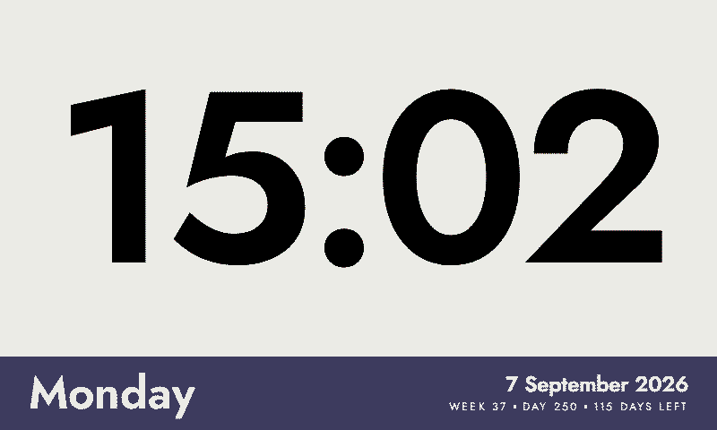
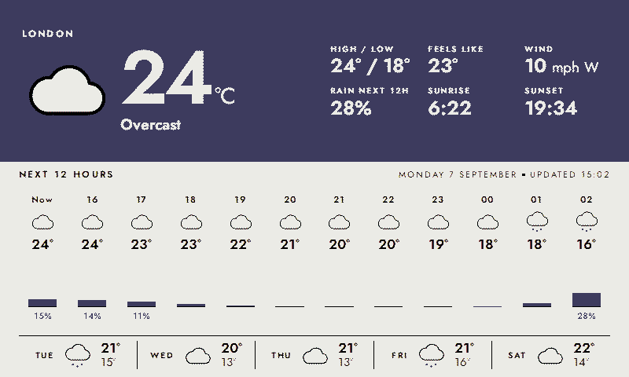
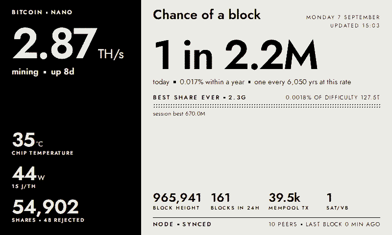

# InkyPi homelab screens

Screens for a 7.3" Pimoroni Inky Impression (2025 Spectra 6 edition) on a Raspberry Pi 4B, built on
[InkyPi](https://github.com/fatihak/InkyPi) by [@fatihak](https://github.com/fatihak).

**This repository is a fork of InkyPi.** The installer, web UI, playlist scheduler and display drivers are
InkyPi's work and are unchanged apart from the two small edits listed under *Changes to upstream*. It is
published under the same GPL-3.0 licence (see `LICENSE`); the original README is kept at
[`docs/UPSTREAM_README.md`](docs/UPSTREAM_README.md). Bug reports about the framework belong upstream;
anything about the screens below belongs here. InkyPi's full history is in this repo, so to pull upstream
changes: `git remote add upstream https://github.com/fatihak/InkyPi.git && git fetch upstream && git merge upstream/main`.

| | |
|---|---|
|  |  |
|  |  |

The screenshots are what the panel shows: renders passed through the same six-colour quantiser the Inky
driver uses (`scripts/spectra6_preview.py`).

## Screens

| Plugin | What it shows | Data source |
|---|---|---|
| `big_clock` | Large clock, with weekday, date, week and day-of-year in a band below | local time |
| `local_weather` | Sky-coloured band (blue for cloud and rain, yellow for sun, black at night) with current conditions and six facts; a 12-hour strip with chance of rain; a 5-day row | [Open-Meteo](https://open-meteo.com/), no key |
| `bbc_news` | Lead story plus three cards, each with the opening paragraphs of the article rather than the feed's one line; section is selectable | BBC RSS and article pages |
| `ai_usage` | Left: cloud spend avoided by a local LLM box today (priced at Claude Sonnet API rates), lifetime gateway totals, GPU busy/now/memory. Right: Claude Code plan limits (session, weekly, per-model) read with the Pi's own Claude login, GPU busy by hour, gateway spend by client and electricity | Prometheus, [LiteLLM](https://github.com/BerriAI/litellm) proxy API, Claude OAuth usage endpoint |
| `home_energy` | Day chart of solar, house load and battery; today's solar, grid and battery totals; a band of live solar, battery, grid and house figures | Home Assistant REST API (FoxESS, Solcast, myenergi, Octopus entities) |
| `bitcoin_miners` | Bitaxe hashrate, temperature, power and shares; odds of finding a block today and within a year; best share against network difficulty; node stats | Bitaxe/ForgeOS JSON API, `bitcoind` exporter in Prometheus |
| `homelab_status` | Host cards with CPU, load, memory and disk gauges; k3s summary; monitoring, Flux, Traefik and storage tiles; a one-line alerts band | Prometheus (node_exporter, kubelet, Flux, Traefik) |
| `night_screen` | A static near-black frame for an overnight playlist window | none |

### Buttons

The four buttons on the back of the Impression are shortcuts. Map each one to a playlist screen under
**Buttons** on the Settings page (or in `device.json` as `"buttons": {"A": {"playlist": ..., "plugin_id": ...,
"plugin_instance": ...}}`); a press shows that screen straight away and the playlist carries on at the next
cycle. The listener (`src/buttons.py`) uses gpiod on GPIO 5, 6, 16 and 24 (A to D, top to bottom) and stays
quiet on machines without a GPIO chip. The 13.3" board wires button C to GPIO 25 instead of 16. The panel takes about 30 seconds to redraw and
can't show anything sooner, so the Pi's green activity LED blinks fast from the press until the redraw finishes.
A press made during a redraw is queued, and the last button pressed wins.

Every screen renders from live data at refresh time. When a data source is unreachable a screen raises an
error rather than drawing zeros, so InkyPi keeps the previous frame and shows the reason in the web UI.

## Also in the repo

- `src/plugins/_theme/` – shared stylesheet and a `ThemedPlugin` mixin the screens use for a consistent look.
- `src/utils/homelab.py` – small Prometheus and Home Assistant clients, and the local settings loader.
- `scripts/spectra6_preview.py` – previews a rendered frame through the Spectra 6 quantiser so you can see
  what the panel will actually show before deploying.
- `scripts/deploy_to_pi.sh user@host` – rsyncs this tree to the Pi, runs the InkyPi installer (first time) or
  updater, copies `.env`, builds `src/config/device.json` from `src/config/device_dev.json` and restarts the
  service. `DEPLOY_QUICK=1` skips the installer for a code-only sync that takes a few seconds.
- `scripts/claude_usage_exporter.py` – optional. Aggregates Claude Code transcripts (tokens and
  API-equivalent cost) on the machine you use Claude Code on and pushes a JSON snapshot to the Pi; the AI
  usage screen adds a cost row when the snapshot is present and fresh. See `install/examples/`.

## Changes to upstream

- `src/inkypi.py`: the web server runs with four threads instead of one. With one thread, a "Display"
  click blocks every other request for the 30 seconds an e-ink refresh takes and the UI looks dead.
- The deploy script writes `"startup": false` into the device config so the splash isn't pushed to the
  panel on every restart (it also delays the web port opening by about 35 seconds).

## Design notes for the Spectra 6 panel

The panel has six inks: black, white, red, yellow, green and blue. Anything else is dithered, so the screens
use flat fills in the exact colours the driver quantises to at its default saturation (`#cd2425`, `#1e1dae`,
`#e7de23`) and avoid greys, gradients and thin glyphs. Small middle-dot separators and anti-aliased text under
about 12 px vanish after quantisation, which is why the theme uses a solid square for separators and keeps
body text at 12 px or larger. A full refresh takes about 30 seconds and flashes through every colour, so the
default playlist cycles every 10 minutes and InkyPi skips the refresh when a frame is identical to the last.

## Setup

1. Flash Raspberry Pi OS Lite and get the Pi on the network, then from a checkout on your workstation run
   `scripts/deploy_to_pi.sh user@host`. It runs InkyPi's own installer, which enables SPI and I2C, installs
   headless Chromium and the Python environment, and creates the `inkypi` service. Reboot once after the
   first install so the interfaces come up. (InkyPi's manual steps are in `docs/UPSTREAM_README.md`.)
2. Copy `src/config/local_settings.example.json` to `src/config/local_settings.json` and fill in your
   Prometheus, Home Assistant, LiteLLM and miner addresses, host names, the Claude credentials path and any
   entity id overrides. The file is gitignored and is synced to the Pi by the deploy script. Every value can
   also be set per screen in the web UI.
3. Add tokens under **API Keys** in the web UI (or to `.env`): `HOME_ASSISTANT_TOKEN` for the energy
   screen, `LITELLM_MASTER_KEY` for the lifetime gateway totals.
4. For the Claude plan limits, log the Pi into Claude: install Claude Code on it
   (`curl -fsSL https://claude.ai/install.sh | bash`), run `claude auth login`, and point `claude_credentials`
   in `local_settings.json` at that user's `~/.claude/.credentials.json`. Access tokens last eight hours;
   the plugin refreshes them itself and writes the rotated tokens back, so nothing else needs to run.
   `claude setup-token` is not enough: its token lacks the `user:profile` scope the usage endpoint requires.
5. Build the playlist in the web UI. For a dark panel overnight, create a second playlist with a window
   such as 22:00 to 07:00 containing only the Night Screen; InkyPi picks the playlist with the shortest
   window, and the static frame means the panel refreshes once at the start of the window and then holds.

## Licence

GPL-3.0, as InkyPi. See `LICENSE`, and `docs/attribution.md` for the fonts and icons InkyPi bundles.
